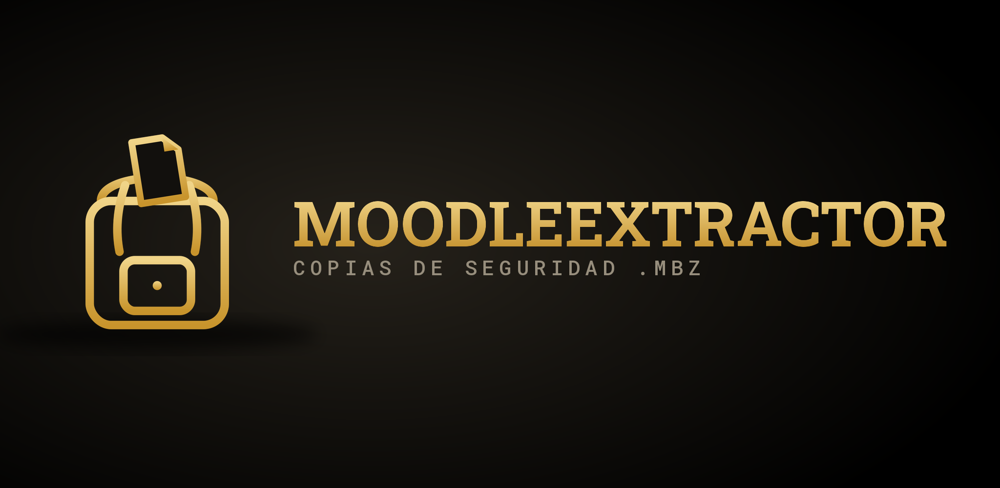

<div align="center">



# MoodleExtractor — Explora copias de seguridad de Moodle (.mbz)

**Sube un archivo `.mbz` (copia de seguridad de un curso de Moodle) y explora, previsualiza y descarga su contenido: PDF, archivos originales o enlaces.**

Pensado para cuando a un profesor le toca dar una asignatura de un día para otro y solo le pasan el `.mbz` del curso de otro año: en vez de restaurarlo en un Moodle solo para poder mirarlo, se abre aquí y se ve todo directamente. Sin dependencias, sin servidor: el archivo nunca sale de tu navegador.

[](https://javitatay.github.io/MoodleExtractor/)
[](https://buymeacoffee.com/javitatay)

   [](LICENSE)

</div>

---

## 📑 Índice

- [¿Qué es MoodleExtractor?](#qué-es-moodleextractor)
- [🌐 Uso](#-uso)
- [🗂️ Qué tipos de contenido reconoce](#️-qué-tipos-de-contenido-reconoce)
- [⬇️ Qué genera la descarga](#️-qué-genera-la-descarga)
- [🔒 Privacidad](#-privacidad)
- [⚠️ Limitaciones conocidas](#️-limitaciones-conocidas)
- [🛠️ Para desarrolladores](#️-para-desarrolladores)
- [🔗 Más herramientas](#-más-herramientas)
- [📄 Licencia](#-licencia)
- [✉️ Contacto](#️-contacto)

---

## ¿Qué es MoodleExtractor?

Un archivo `.mbz` es la copia de seguridad de un curso de Moodle: por dentro es un `.tar.gz` con toda la estructura del curso en XML (secciones, actividades) más los archivos reales. Para verlo normalmente hace falta restaurarlo en un Moodle — MoodleExtractor se salta ese paso: lo interpreta directamente en el navegador y te deja navegar el curso como un árbol de carpetas, con una vista previa del texto de cada actividad.

Es la herramienta pensada para ese "toma, esto es lo que dio el compañero el año pasado" de última hora: en un par de minutos tienes claro qué contenidos hay, y te llevas justo los que necesitas ya convertidos a algo legible.

### Funciones principales

- 📂 **Árbol navegable** del curso completo: secciones → actividades, con icono y tipo de cada una (página, etiqueta, archivo, carpeta, URL, libro, foro, tarea, cuestionario...).
- 👁️ **Vista previa en el propio navegador** del texto de cualquier página, etiqueta o libro, sin necesidad de descargar nada primero.
- ✅ **Selección por casillas** a nivel de sección o de actividad individual, con "Seleccionar todo" / "Deseleccionar todo".
- 📄 **Conversión automática a PDF** (o `.txt` si lo prefieres) del texto de páginas, etiquetas y libros — legible directamente, sin depender de Moodle.
- 📎 **Archivos originales incluidos tal cual** (PDF, imágenes, documentos...) organizados por sección y actividad.
- 🔗 **Enlaces URL** exportados como acceso directo `.url`, y listados con su dirección en el índice.
- 📝 **Índice general en Markdown y en HTML navegable** (`00_Indice.md` / `Indice.html`) generados automáticamente con toda la estructura del curso; el HTML enlaza directamente a cada PDF, archivo o enlace ya extraído, para moverte por el curso sin abrir carpeta por carpeta.
- ❓ **Preguntas de los cuestionarios extraídas** (opción múltiple, verdadero/falso, respuesta corta, ensayo), con la respuesta correcta marcada — a partir del banco de preguntas real del backup, no solo el nombre del cuestionario.
- 💬 **Mensajes de foros** (incluido el de "Avisos"), **entradas de glosario** y **opciones de consultas/elecciones**, cuando el backup incluye datos de usuario — con aviso claro cuando no es el caso, en vez de mostrarlo vacío sin explicación.
- 📖 **PDF único de todo el curso**, opcional, con cada actividad en su propia página — para leer o imprimir de un tirón en vez de abrir un archivo por actividad.
- ⚠️ **Avisos claros** cuando alguna actividad no se ha podido leer completamente (backup incompleto, tipo no soportado…), en vez de fallar en silencio.
- 🧩 **Archivos "huérfanos"** del backup no ligados a ninguna actividad visible (adjuntos del banco de preguntas, etc.) listados aparte, por si también interesan.
- 🌙 **Tema oscuro / claro.**
- ⚡ **El trabajo pesado corre en un Web Worker**: la pestaña no se congela ni con backups grandes.

---

## 🌐 Uso

1. Abre [javitatay.github.io/MoodleExtractor](https://javitatay.github.io/MoodleExtractor/) (o el `index.html` en local, funciona igual).
2. Arrastra el archivo `.mbz` sobre la zona indicada, o haz clic para seleccionarlo.
3. Explora el árbol de secciones y actividades; usa "Ver contenido" para leer el texto de cualquiera sin descargar nada.
4. Marca lo que te interesa (por sección o actividad suelta) y elige si el texto se exporta como PDF o TXT.
5. Pulsa **Descargar selección** — se genera un `.zip` con todo organizado por carpetas, listo para abrir.

No hace falta instalar nada ni tener Moodle a mano. Funciona igual publicado en GitHub Pages que abriendo `index.html` directamente desde el disco.

---

## 🗂️ Qué tipos de contenido reconoce

MoodleExtractor interpreta el formato de backup `moodle2` (el usado por Moodle 2.x en adelante, que sigue siendo el formato de exportación actual). Reconoce específicamente:

| Tipo de actividad | Qué extrae |
|---|---|
| 📄 Archivo (`resource`) | El archivo original adjunto |
| 📁 Carpeta (`folder`) | Todos los archivos que contiene |
| 🔗 URL | La dirección enlazada |
| 📃 Página (`page`) | El texto completo, con avisos de vídeos/imágenes incrustados y enlaces |
| 🏷️ Etiqueta (`label`) | El texto de la etiqueta |
| 📚 Libro (`book`) | Todos los capítulos, en orden |
| ❓ Cuestionario (`quiz`) | Todas las preguntas y respuestas del banco asociado, con la correcta marcada |
| 💬 Foro (`forum`) | Debates y mensajes (si el backup incluye datos de usuario) |
| 📖 Glosario (`glossary`) | Concepto y definición de cada entrada |
| 🗳️ Consulta (`choice`) | Las opciones planteadas |

El resto de tipos (tarea, wiki, taller, SCORM, LTI...) se muestran igualmente en el árbol con su nombre y descripción, marcados como "vista simplificada" — se listan y se puede extraer su descripción, pero no su contenido interactivo completo (entregas de una tarea, paquetes SCORM, etc.), ya que eso no tiene un equivalente razonable en PDF o archivo suelto.

---

## ⬇️ Qué genera la descarga

Un `.zip` con esta estructura, sea cual sea el curso:

```
Nombre del curso/
├── Indice.html                          (índice navegable, clic para abrir cada archivo)
├── 00_Indice.md
├── 01_Nombre de la sección/
│   ├── 01_Nombre de la actividad/
│   │   ├── Nombre de la actividad.pdf   (texto de la actividad, si lo tiene)
│   │   └── archivo_original.pdf         (si la actividad incluye adjuntos)
│   └── 02_Otro enlace/
│       └── enlace.url
├── 02_Otra sección/
│   └── ...
└── Otros archivos del curso/            (solo si se marcan explícitamente)
```

---

## 🔒 Privacidad

Todo el procesamiento — descompresión, lectura del XML, generación del PDF y del ZIP final — ocurre dentro de tu navegador con JavaScript. El archivo `.mbz` **nunca se sube a ningún servidor**: MoodleExtractor no tiene backend. Puedes comprobarlo abriendo las herramientas de red del navegador durante el proceso, o simplemente desconectando internet después de cargar la página: seguirá funcionando igual.

---

## ⚠️ Limitaciones conocidas

- La conversión a PDF es de **solo texto**: no reproduce el diseño visual original de una página de Moodle, ni incrusta las imágenes dentro del propio PDF (las imágenes se incluyen aparte, como archivo, en la misma carpeta).
- Los vídeos incrustados (YouTube, etc.) se señalan con su enlace en el texto, no se descargan.
- Los mensajes de foro y las entradas de glosario solo aparecen si el backup se generó **con datos de usuario** (opción que se marca al crear la copia de seguridad en Moodle); si no, la actividad se lista igual pero se avisa de que no hay contenido que mostrar, en vez de dejarlo vacío sin más.
- Los cuestionarios extraen pregunta y respuestas para los tipos más comunes (opción múltiple, verdadero/falso, respuesta corta, ensayo); tipos más complejos (emparejamiento, arrastrar y soltar, Cloze) se detectan pero sin sus opciones detalladas, y alguna pregunta puntual puede no resolverse si el backup usa un banco de preguntas compartido con un formato de referencia distinto — en ese caso se avisa en vez de fallar en silencio.
- Otras actividades interactivas (tareas, foros con respuestas, SCORM...) se listan con su descripción, pero su contenido interno no se convierte — normalmente no tiene sentido fuera de Moodle.
- Backups muy antiguos (formato Moodle 1.9, previo al formato `moodle2`) no están soportados.
- Se ha probado con backups de tamaño moderado; con backups enormes (varios GB, típicamente cursos con muchos vídeos pesados) el navegador necesitará bastante memoria RAM libre, al mantenerse todo en memoria durante el proceso.

---

## 🛠️ Para desarrolladores

MoodleExtractor es una aplicación web autocontenida en `index.html`, sin frameworks ni dependencias externas — ni siquiera para las partes más "difíciles":

- **Descompresión GZIP/DEFLATE** (RFC 1951/1952): implementación propia desde cero, con tabla de Huffman canónica.
- **Lector de TAR**: soporta ustar, nombres largos GNU y cabeceras PAX (necesario para rutas y nombres de archivo largos o con acentos).
- **Escritor de ZIP**: formato STORED (sin comprimir, ya que el contenido viene de un `.mbz` ya comprimido), con soporte UTF-8 en los nombres.
- **Generador de PDF**: minimalista, con las fuentes base-14 (Helvetica/Helvetica-Bold) y ajuste de línea propio — sin incrustar ninguna fuente.

El trabajo pesado (descomprimir y desempaquetar) se ejecuta en un **Web Worker** creado a partir de un `<script type="text/plain">` embebido en el propio HTML (vía `Blob`+`URL.createObjectURL`), para no depender de un segundo archivo `.js` y mantener la app en un único fichero distribuible. La interpretación del XML (que necesita `DOMParser`) se hace de vuelta en el hilo principal.

El parser del backup se basa en el mecanismo real de Moodle para asociar archivos a actividades (`inforef.xml` → id de archivo → `files.xml` → `files/<hash[0:2]>/<hash>`), no en heurísticas por nombre — así funciona igual de bien con cualquier tipo de actividad que use archivos adjuntos, presente o futuro.

```
MoodleExtractor/
│
├── README.md
├── LICENSE
└── index.html
```

Al ser un único archivo, distribuirlo es simplemente copiar `index.html` — no hace falta ningún paso de compilación ni `npm install`.

---

## 🔗 Más herramientas

Otras herramientas para producción audiovisual en directo y docencia:

- ⏱️ **Tatimer** — Temporizador para el monitor del ponente en eventos en directo. [Ver proyecto](https://github.com/javitatay/Tatimer) · [Demo](https://javitatay.github.io/Tatimer/)
- 🎪 **Tarimeo** — Diseña y organiza la distribución de tarimas y escenarios. [Ver proyecto](https://github.com/javitatay/Tarimeo) · [Demo](https://javitatay.github.io/Tarimeo/)
- 📡 **RFTDT** — Consulta de frecuencias TDT libres para microfonía inalámbrica. [Ver proyecto](https://github.com/javitatay/RFTDT) · [Demo](https://javitatay.github.io/RFTDT/)
- 🔷 **VectorSlice** — Convierte vectores de Illustrator en Slices de Resolume Arena. [Ver proyecto](https://github.com/javitatay/VectorSlice) · [Demo](https://javitatay.github.io/VectorSlice/)
- 🎓 **AVV Lab** — Plataforma educativa interactiva de Animación Visual en Vivo. [Ver proyecto](https://github.com/javitatay/AVV) · [Demo](https://javitatay.github.io/AVV/)

---

## 📄 Licencia

MoodleExtractor se distribuye bajo la licencia **[GNU General Public License v3.0](LICENSE)**.

Eres libre de usar, estudiar, modificar y compartir este software. La única condición importante es que, si distribuyes una versión modificada, debe mantenerse también como código abierto bajo esta misma licencia, para que las mejoras sigan estando disponibles para todos.

[](LICENSE)

---

## ✉️ Contacto

**Javier Tatay Rubio**
📧 j.tatayrubio@edu.gva.es · javitatay@gmail.com

---

<div align="center">
<sub>MoodleExtractor · 2026</sub>
</div>
